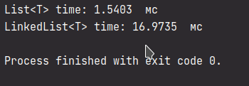

## Задание 1

Наша задача — сравнить производительность вставки в `List<T>` и `LinkedList<T>`.
Для этого используйте уже знакомый вам `StopWatch`.

На примере этого [текста](./Text1.txt), выясните, какие будут различия между этими коллекциями.

## Скриншот

