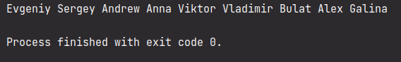

## Задание

# Практика

Есть список учеников школы с разбивкой по классам:

```cs
using System;
using System.Collections.Generic;
using System.Linq;

namespace Task1
{
   class Program
   {
       static void Main(string[] args)
       {
           var classes = new []
           {
               new Classroom { Students = {"Evgeniy", "Sergey", "Andrew"}, },
               new Classroom { Students = {"Anna", "Viktor", "Vladimir"}, },
               new Classroom { Students = {"Bulat", "Alex", "Galina"}, }
           };
           var allStudents = GetAllStudents(classes);

           Console.WriteLine(string.Join(" ", allStudents));
       }

       static string [] GetAllStudents( Classroom [] classes )
       {
           // ???
       }

       public class Classroom
       {
           public List<string> Students = new List<string>();
       }
   }
}
```

Напишите метод, который соберет всех учеников всех классов в один список, используя _LINQ_.

## Скриншот


