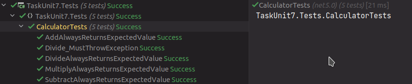

## Задание

# Практика

Протестируйте все методы класса `Calculator` с использованием **NUnit**-фреймворка.

```cs
namespace Practices
{
    public class Calculator
    {
        public int Additional(int a, int b)
        {
            return a + b;
        }

        public int Subtraction(int a, int b)
        {
            return a - b;
        }

        public int Miltiplication(int a, int b)
        {
            return a * b;
        }

        public int Division(int a, int b)
        {
            return a / b;
        }
    }
}
```

## Скриншот


