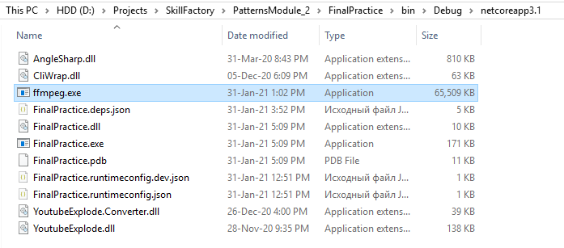

# ЗАДАНИЕ 2

Сейчас мы попробуем создать реальное приложение, используя паттерн команда (Command) и библиотеку YoutubeExplode.

Приложение вы сможете потом использовать сами, оно сможет загружать видео с хостинга YouTube, а также выводить информацию о видео в консоль.

## Подготовка

1. Создайте в среде разработки проект — консольное приложение _.NET Core_, и установите в него `NuGet`-пакеты [YoutubeExplode](https://www.nuget.org/packages/YoutubeExplode/) и [YoutubeExplode.Converter](https://www.nuget.org/packages/YoutubeExplode.Converter/).

2. Для работы с видео библиотека предоставляет объект **YoutubeClient.Videos**, у которого вам понадобятся два метода:

  - `videos.GetAsync(string videoUrl)` — получить описание видео; 
  - `await videos.DownloadAsync(string videoUrl, string outputFilePath)` — запустить скачивание видео. 

Чтобы кодирование видео проходило быстрее, можно передать в этот метод третий параметр: `builder => builder.SetPreset(ConversionPreset.UltraFast)`.

3. Для кодирования скачанного видео в _MPEG-4_ и сохранения в файл библиотека _YoutubeExplode_ будет использовать кодек _Ffmpeg.exe_. 

Скачать его под свое устройство вы можете по [ссылке](https://github.com/BtbN/FFmpeg-Builds/releases). После скачивания ._exe_ файл нужно положить в ту же папку, куда билдится исходный код вашей программы (к примеру, если у вас проект использует `.Net Core 3.1, то это — bin\Debug\netcoreapp3.1`):

Скачанное видео у вас будет сохраняться сюда же.

> ## Задание
> 
> Используя паттерн Команда и созданный выше шаблон, напишите консольную программу, которая будет:
> 
>   - Принимать на вход ссылку на _Youtube_-видео. 
>  - Выводить в консоль информацию: название видео и описание.
>  - Скачивать видео.

У вас должно быть две команды: на получение информации о видео и на скачивание.

Советуем тестировать вашу программу на коротких видео, или на видео в не слишком высоком качестве, иначе загрузка будет занимать много времени.