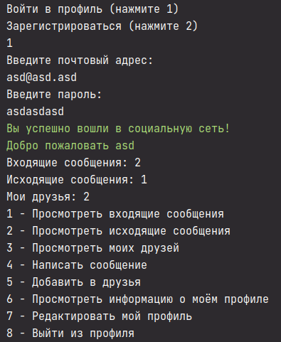
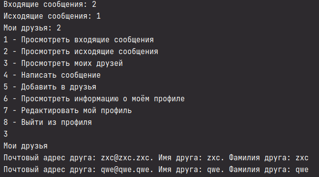
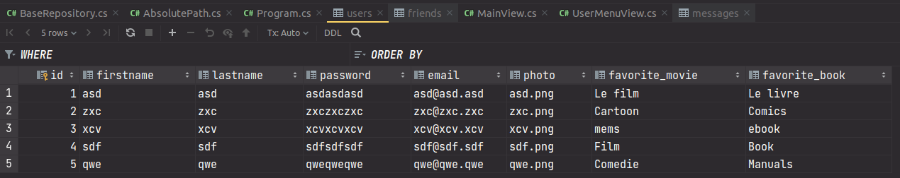
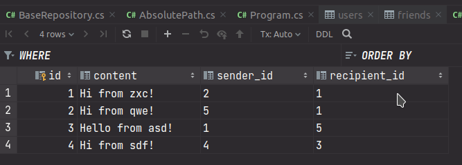
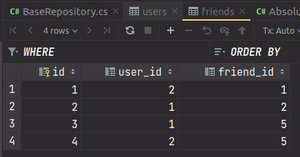

## Задание

# 19.5. Практикум

Домашним заданием будет реализовать логику **добавления в друзья** в нашей социальной сети.

_В нашем проекте на уровне `DAL` (`Data Access Layer`) уже реализована логика по работе с друзьями. Поэтому уровня `DAL` вам нет смысла касаться._

Вашей же задачей становится добавление логики на уровень `PLL` и `BLL`. Процесс добавления пользователя в друзья должен быть следующим:

1. Пользователь вводит почтовый адрес друга.
2. Если почтовый адрес существует, то выполняем добавление.
3. Если почтового адреса не существует, то выбрасываем исключение `UserNotFoundException`.

На уровне `PLL` по аналогии с другими классами `View` создайте новую `View`, в которую поместите основную логику представления для добавления в друзья.

**ПРИКРЕПИТЕ ССЫЛКУ НА GITHUB С РЕШЕНИЕМ ЗАДАНИЯ, УБЕДИВШИСЬ, ЧТО РЕПОЗИТОРИЙ ОТКРЫТ**

### \*Задание будет оцениваться по следующим критериям:

- 0 баллов – задание решено неверно;

- 1 балл – есть попытки решить задачу, но функциональности нет;

- 2 балла – есть решение задачи, функциональность по добавлению в друзья работает, но студент сильно отошел от исходной архитектуры проекта;

- 3 балла – есть решение задачи, функциональность по добавлению в друзья работает, студент правильно выбрал архитектуру проекта;

- 4 балла – есть решение задачи, функциональность по добавлению в друзья работает, студент правильно выбрал архитектуру проекта, добавил проект модульного теста и написал хотя бы один юнит-тест.

## Screenshots

